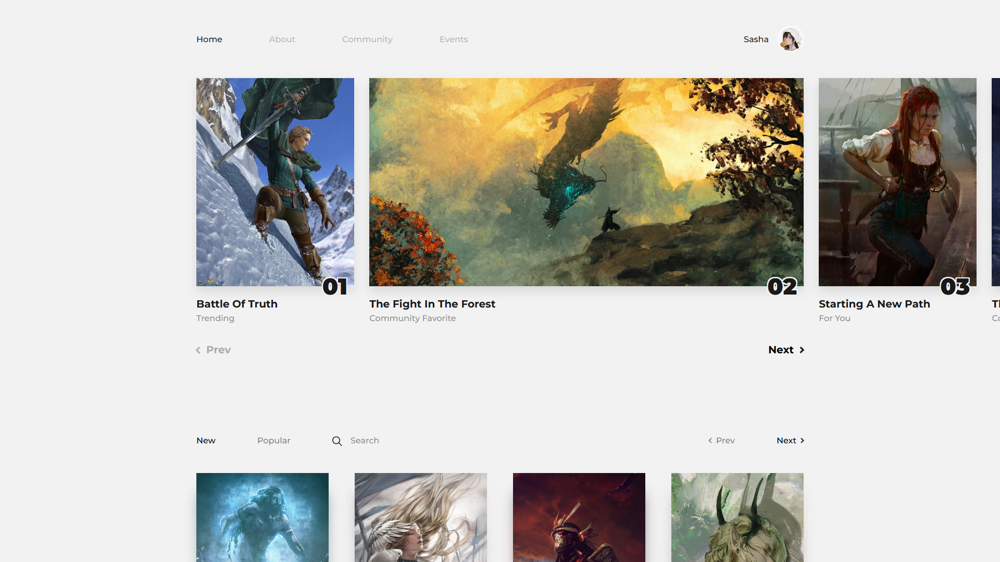
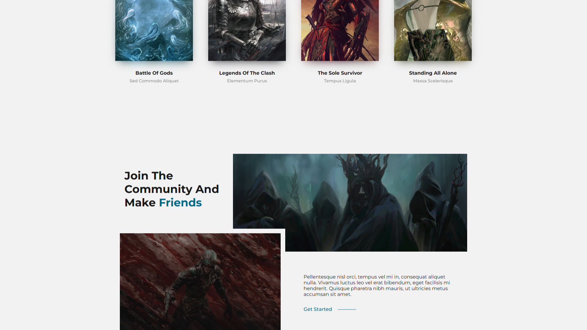
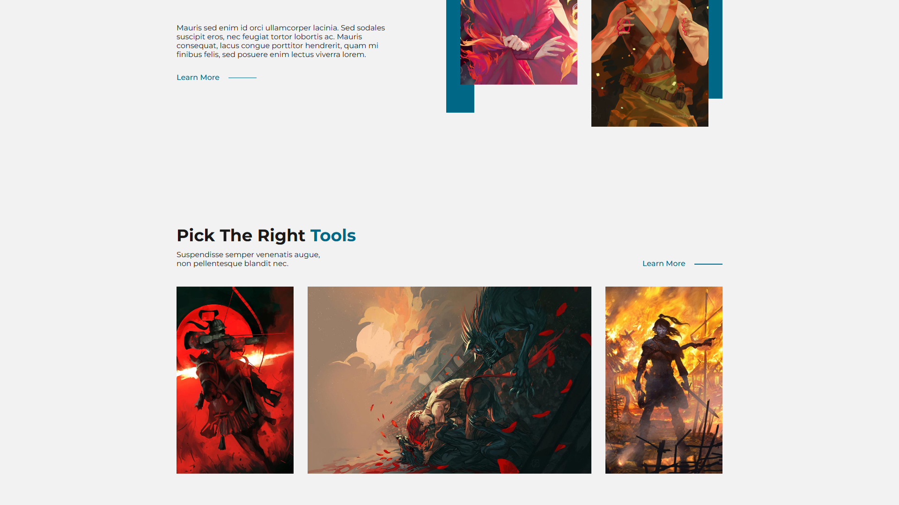

# Advanced Queries Web Application

[Live Demo](https://full-stack-query-application.onrender.com) • It's named queries web applcation because the main feature in this application is that users can search and filter posts. This is full-stack MERN web Application. Frontend is a single page react web application and it fetches and displays the data in a responsive UI.

## Key Features

- Fuzzy search implementation
- Multi-criteria filtering
- Type-safe API endpoints
- Custom slider in frontend
- Client-side state management with Redux Toolkit
- Input validation with Joi schema
- Unit and intergration tests in frontend
- CRUD operations for in the backend

## Tech Stack

**Frontend:**

- React + TypeScript
- Redux Toolkit (state management)
- Sass styling

**Backend:**

- Express.js + TypeScript
- MongoDB native driver
- Joi validation
- TypeScript compilation

**Database:**

- MongoDB

**DevOps:**

- GitHub Actions (CI/CD)

## Setup

1. Clone repository
2. Install dependencies: `npm run install-all`
3. Use `.env.example` to configure `.env` with MongoDB URI
4. Populate database: `npm run populate-database`
5. Start development: `npm run dev`

## Development

- `npm run dev`: Concurrent server/client (TypeScript watch mode)
- `npm run build`: Full production build (compiles both TS and React)
- `npm start`: Production server start

Access endpoints:

- API: http://localhost:5000
- Client: http://localhost:3000

## Screenshots

